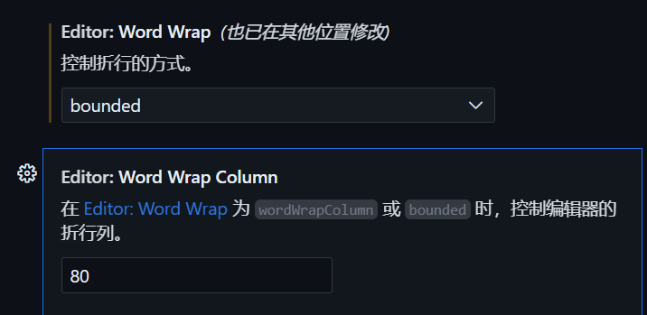
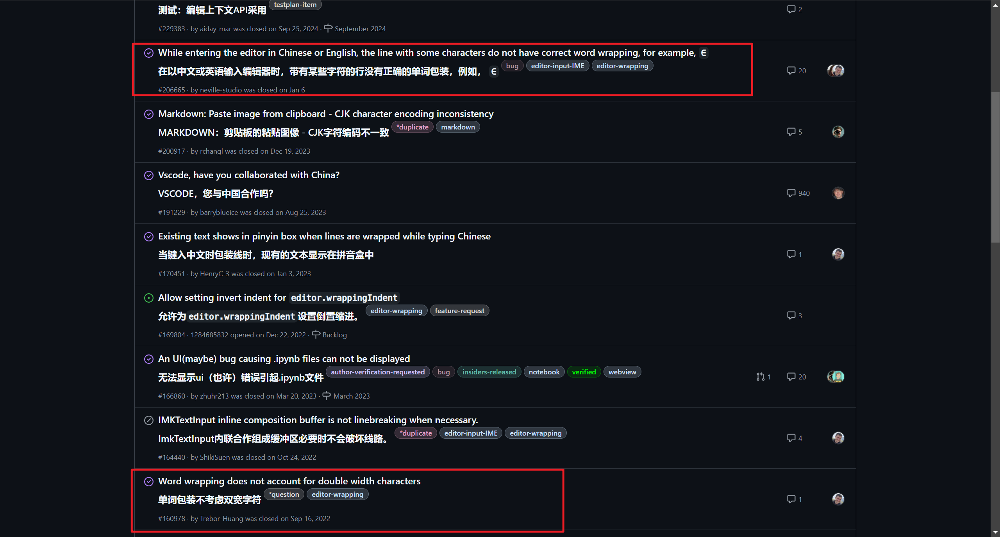

**TLDR：解决方法写在最后一部分了**

## 发现问题

VsCode中在开启word wrap，且word wrap正在视区宽度出生效的情况下，当代码中有一行出现大段中文会导致word wrap以后的文字仍然会超出视图范围。
设置
超出视图范围的例子

## 参考资料

在VsCode的GitHub Repo的issue里搜索wrap chinese 得到的结果中的如下两条（解决方案来自最后一条）

## 解决方法以及原因

原因是默认的wrapping strategy是simple，是一种快速算法，适用于等宽字体和某些字形宽度相等的字体。

方法1：设置中找到editor: wrapping strategy，把simple改成advanced。

方法2：说明你现在用的字体不是等宽字体（被Maple Mono坑了，可恶），所以改成等宽字体，simple模式就可以正常工作了。